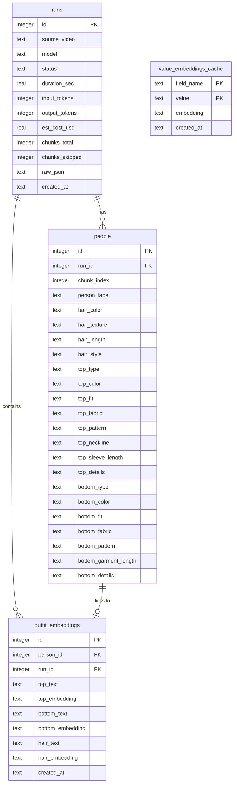

# Wovely

Wovely is a video-based clothing and hair attribute extraction system powered by Google Gemini multimodal models. The application uploads video files, extracts detailed clothing and physical attributes, saves the structured extraction results to a local database, generates semantic text embeddings, and visualizes similarity mappings inside an interactive 2D **Outfit Constellation**.

---

## Key Features

- **Multimodal Extraction**: Leverages Google Gemini multimodal capabilities (`gemini-3.1-flash-lite`, `gemini-2.5-flash`, etc.) to analyze video footage.
- **Granular Attribute Schema**: Identifies and categorizes:
  - **Hair**: Color, texture, length, style.
  - **Tops**: Type, color, fit, fabric, pattern, neckline, sleeve length, styling details.
  - **Bottoms**: Type, color, fit, fabric, pattern, garment length, styling details.
- **Intelligent Embeddings**: Generates and caches 768-dimensional text embeddings (`text-embedding-004`) for each attribute category to enable semantic similarity comparisons.
- **Interactive UI (SPA)**: A single-page dashboard featuring:
  - A modern, responsive **Glassmorphism** styling.
  - Drag-and-drop video upload queue with batch configuration.
  - **Outfit Constellation**: A 2D mapping visualizing outfit distribution and cluster proximity.
  - Interactive similarity lookup that calculates similarity scores with detailed category breakdowns (top vs. bottom vs. hair).
- **Safety Safeguards**: Built-in minor detection controls to abort processing of footage containing minors if not authorized.
- **Robust Storage**: Uses SQLite with self-managing schema migrations.

---

## Codebase Architecture

- **`app.py`**: The Flask application exposing the Web SPA and REST endpoints.
- **`extractor.py`**: Interacts with the Google GenAI SDK, implements the schema parsing, token estimation, cost calculation, and safety check boundaries.
- **`database.py`**: Handles connection pooling, SQLite transactions, DB schema initialization, and database migrations.
- **`embedder.py`**: Manages vector embedding retrieval, runs category weighting calculations for similarity scores, and computes 2D coordinates for the constellation layout.
- **`templates/` & `static/`**: Holds the frontend assets including styling (`style.css`), interactions (`app.js`), and layout templates (`index.html`).
- **`test_*.py`**: Test suites covering controllers, services, embedding logic, and extraction pipelines.

---

## Database Schema



---

## Getting Started

### Prerequisites
- Python 3.10+
- Google Gemini API Key
- **ExifTool** (Optional, required for embedding AI findings directly into video files):
  - macOS: `brew install exiftool`
  - Linux: `sudo apt-get install libimage-exiftool-perl` (or equivalent)
  - Windows: Download from [exiftool.org](https://exiftool.org/) and add to PATH.

### Installation

1. Clone or navigate to the repository directory:
   ```bash
   cd Wovely
   ```

2. Create and activate a virtual environment:
   ```bash
   python3 -m venv .venv
   source .venv/bin/activate
   ```

3. Install project dependencies:
   ```bash
   pip install -r requirements.txt
   ```

4. Configure your environment variables. Create a `.env` file in the root directory:
   ```env
   GEMINI_API_KEY=your_google_gemini_api_key
   ```

5. Run the web server:
   ```bash
   python3 app.py
   ```
   Open [http://127.0.0.1:5000](http://127.0.0.1:5000) in your web browser.

---

## Running Tests

To run the full suite of unit tests, use the Python interpreter in your virtual environment:

```bash
.venv/bin/python3 -m unittest
```
